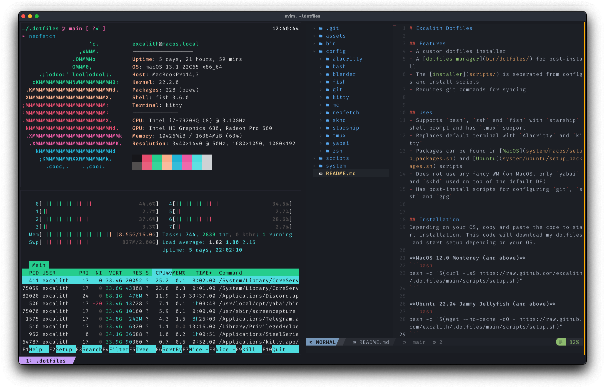

<p align="center">
	<h1 align="center">brahmatruti Dotfiles</h1>
</p>



## Features

- **Multi-OS Support**: Ubuntu, Debian, Windows, macOS, Arch Linux, Alpine Linux + 8 more experimental
- **Centralized Configuration**: All app configs in `config/` directory
- **Development Machine Detection**: Interactive setup for dev environments
- **Modern Package Managers**: Native to each OS (apt, winget, brew, pacman, apk, rpm, etc.)
- **VSCode Integration**: 50+ curated extensions with centralized settings
- **Infrastructure Tools**: Docker, Ansible, Terraform across all platforms
- **Shell Support**: Fish, Zsh, Bash, PowerShell with Starship prompt
- **NFS Support**: Network file system configuration (Linux)
- **Security Focused**: Package verification and minimal installations
- **Error Handling**: Comprehensive logging, retry logic, and user recovery options
- **Multi-Architecture**: Support for Debian-based, RPM-based, Arch-based, and more

## Enhanced Installation System

### **Smart Error Recovery**
- **Automatic Retries**: Failed installations retry up to 2 times with 3-second intervals
- **Auto-Continue**: 3-second timeout prevents installation hangs - continues automatically
- **Detailed Logging**: Color-coded output with symbols (✓ ✗ ⊝ ⚠ ℹ ⟲) for clear progress tracking
- **Installation Summary**: Complete report showing success/failure statistics at completion

### **Cross-Platform Consistency**
All operating systems now feature identical error handling and logging:
- **Debian/Ubuntu**: Enhanced APT package management with GPG key safety checks
- **macOS**: Homebrew package management with comprehensive error recovery
- **Windows**: WinGet/Chocolatey package management with PowerShell integration
- **Arch Linux**: Pacman/AUR package management with yay support
- **Alpine Linux**: APK package management with lightweight optimizations
- **WSL**: Ubuntu integration within Windows with full feature parity
- **Lite**: Minimal installation for mobile/embedded systems

### **Installation Summary Example**
```
╔════════════════════════════════════════════════════════════════╗
║                    INSTALLATION SUMMARY                     ║
╚════════════════════════════════════════════════════════════════╝

✓ SUCCESSFUL PACKAGES (15):
  • Build Essential (build-essential)
  • Docker (docker-ce docker-ce-cli containerd.io docker-compose-plugin)

⊝ SKIPPED PACKAGES (3):
  • Alacritty (alacritty) - Not available in Debian
  • tre-command (tre-command) - Not available in Debian

✗ FAILED PACKAGES (2):
  • MEGASync (megasync) - Failed to install after 2 attempts
  • Synology Drive Client (synology-drive) - Failed to install after 2 attempts

📊 STATISTICS:
  Total packages processed: 20
  Successfully installed: 15
  Skipped: 3
  Failed: 2
  Success rate: 75% ⚠️

💡 RECOMMENDATIONS:
  • Review the failed packages list above
  • Check your internet connection
  • Verify package names for your OS/distribution
  • Try installing failed packages manually
```

## Architecture

- **[Configuration Hub](config/)**: Centralized application configurations
- **[OS-Specific Scripts](system/)**: Installation scripts per operating system
- **[Memory Bank](memory-bank.md)**: Comprehensive implementation guide
- **[VSCode Setup](config/vscode/)**: Editor configuration and extensions
- **[Documentation](system/*/README.md)**: Detailed guides per OS

## Installation

> [!CAUTION]
> If you have no idea what a dotfile is all about, please do not simply run these commands. They will override your configurations with my configurations and install bunch of packages.

The installation automatically detects your operating system and runs the appropriate setup. Choose your OS family below:

### 🪟 **Windows Family** (Windows 10/11, WSL)
<details>
 <summary>Windows 10/11 Setup</summary>

**Native Windows Setup:**
```powershell
# Allow remote scripts to run
Set-ExecutionPolicy Bypass -Scope Process; Set-ExecutionPolicy -Scope CurrentUser -ExecutionPolicy RemoteSigned -Force

# Download and start setup
Invoke-Expression (Invoke-WebRequest -Uri 'https://raw.githubusercontent.com/brahmatruti/.dotfiles/main/scripts/setup.ps1').Content

# Reset Execution Policy (Optional)
Set-ExecutionPolicy -Scope Process -ExecutionPolicy Restricted
```

**WSL Ubuntu Setup:**
```bash
# Run in WSL terminal
bash -c "$(wget --no-cache -qO - https://raw.github.com/brahmatruti/.dotfiles/main/scripts/setup.sh)"
```
</details>

### 🐧 **Linux Family** (Ubuntu, Debian, Arch, Alpine, + Experimental)
<details>
 <summary>Ubuntu 22.04+ / Debian 11/12</summary>
<pre lang="bash">bash -c "$(wget --no-cache -qO - https://raw.github.com/brahmatruti/.dotfiles/main/scripts/setup.sh)"</pre>
</details>

<details>
 <summary>Arch Linux / Manjaro / EndeavourOS</summary>
<pre lang="bash">bash -c "$(wget --no-cache -qO - https://raw.github.com/brahmatruti/.dotfiles/main/scripts/setup.sh)"</pre>
</details>

<details>
 <summary>Alpine Linux</summary>
<pre lang="bash">bash -c "$(wget --no-cache -qO - https://raw.github.com/brahmatruti/.dotfiles/main/scripts/setup.sh)"</pre>
</details>

<details>
 <summary>Fedora / RHEL / CentOS / Rocky / AlmaLinux (Experimental)</summary>
<pre lang="bash">bash -c "$(wget --no-cache -qO - https://raw.github.com/brahmatruti/.dotfiles/main/scripts/setup.sh)"</pre>
</details>

<details>
 <summary>openSUSE / SLES (Experimental)</summary>
<pre lang="bash">bash -c "$(wget --no-cache -qO - https://raw.github.com/brahmatruti/.dotfiles/main/scripts/setup.sh)"</pre>
</details>

<details>
 <summary>Gentoo / Funtoo (Experimental)</summary>
<pre lang="bash">bash -c "$(wget --no-cache -qO - https://raw.github.com/brahmatruti/.dotfiles/main/scripts/setup.sh)"</pre>
</details>

<details>
 <summary>Void Linux (Experimental)</summary>
<pre lang="bash">bash -c "$(wget --no-cache -qO - https://raw.github.com/brahmatruti/.dotfiles/main/scripts/setup.sh)"</pre>
</details>

### 🍎 **macOS Family**
<details>
 <summary>macOS Monterey (12.0+) and above</summary>
<pre lang="bash">bash -c "$(curl -LsS https://raw.github.com/brahmatruti/.dotfiles/main/scripts/setup.sh)"</pre>
</details>

### 📱 **Android Family**
<details>
 <summary>Termux (Android)</summary>

**Lite Version for Termux:**
```bash
bash -c "$(curl -LsS https://raw.github.com/brahmatruti/.dotfiles/main/system/lite/install.sh)"
```

**Full Version (if you have git):**
```bash
git clone https://github.com/brahmatruti/.dotfiles.git ~/.dotfiles
cd ~/.dotfiles
bash system/lite/install.sh
```
</details>

### Lite Version

This is a minimal installation for Termux app on Android.

```bash
bash -c "$(curl -LsS https://raw.github.com/brahmatruti/.dotfiles/main/system/lite/install.sh)"
```

### Windows (10 and above)

#### Windows

Allow remote scripts to run

```ps
Set-ExecutionPolicy Bypass -Scope Process; Set-ExecutionPolicy -Scope CurrentUser -ExecutionPolicy RemoteSigned -Force
```

Download the dotfiles and start setup

```ps
Invoke-Expression (Invoke-WebRequest -Uri 'https://raw.githubusercontent.com/brahmatruti/.dotfiles/main/scripts/setup.ps1').Content
```

Reset Execution Policy (Optional)

```ps
Set-ExecutionPolicy -Scope Process -ExecutionPolicy Restricted
```

#### WSL Ubuntu

To install packages for WSL Ubuntu, run the following command on WSL terminal.

```bash
bash -c "$(wget --no-cache -qO - https://raw.github.com/brahmatruti/.dotfiles/main/scripts/setup.sh)"
```

## Supported Operating Systems

### 🪟 **Windows Family**
#### Windows 10/11 (Native)
- **Package Managers**: WinGet, Chocolatey, PowerShell
- **Features**: WSL support, Registry configuration, PowerShell scripts
- **Documentation**: [Windows Guide](system/windows/README.md)
- **Development Tools**: Docker Desktop, Azure CLI, AWS CLI, Python, Node.js
- **Error Handling**: Comprehensive logging and recovery options

#### Windows WSL (Ubuntu)
- **Package Managers**: APT, Snap, Flatpak
- **Features**: Full Ubuntu integration within Windows
- **Documentation**: [Ubuntu Guide](system/ubuntu/README.md)
- **Development Tools**: Docker, Ansible, Terraform, Python, Java, Node.js

### 🐧 **Linux Family**

#### Debian/Ubuntu-based (Fully Supported)
- **Ubuntu 22.04+**: PPAs, latest packages, Gnome integration
- **Debian 11/12**: Stable repositories, security-focused
- **Package Managers**: APT, Snap, Flatpak
- **Features**: NFS support, Gnome integration, development tools, cloud storage clients
- **Cloud Storage**: pCloud Drive, MEGASync, Synology Drive Client, rclone (Google Drive)
- **Documentation**: [Ubuntu Guide](system/ubuntu/README.md) | [Debian Guide](system/debian/README.md)

#### Arch-based (Fully Supported)
- **Arch Linux**: Rolling release, minimal base, AUR support
- **Manjaro**: User-friendly Arch derivative
- **EndeavourOS**: Easy-to-use Arch experience
- **Package Managers**: Pacman, AUR (yay/paru)
- **Features**: Latest packages, minimal installation, cloud storage clients
- **Cloud Storage**: MEGASync, Synology Drive Client, rclone (Google Drive), pCloud Drive
- **Documentation**: [Arch Guide](system/arch/README.md)

#### Alpine-based (Fully Supported)
- **Alpine Linux**: Lightweight, security-focused, Docker-ready
- **Package Managers**: APK
- **Features**: Minimal resource usage, container optimization
- **Cloud Storage**: MEGASync, rclone (Google Drive) - limited availability
- **Documentation**: [Alpine Guide](system/alpine/README.md)

#### RPM-based (Experimental)
- **Fedora**: Latest packages, Red Hat sponsored
- **RHEL/CentOS/Rocky/AlmaLinux**: Enterprise-focused, stable
- **Package Managers**: DNF/YUM, RPM
- **Features**: Enterprise support, long-term stability
- **Documentation**: Coming soon

#### SUSE-based (Experimental)
- **openSUSE**: Community-driven, cutting-edge packages
- **SLES**: Enterprise SUSE Linux
- **Package Managers**: Zypper, RPM
- **Features**: Strong enterprise support
- **Documentation**: Coming soon

#### Gentoo-based (Experimental)
- **Gentoo**: Source-based, highly customizable
- **Funtoo**: Gentoo derivative with optimizations
- **Package Managers**: Portage, emerge
- **Features**: Compile-time optimization
- **Documentation**: Coming soon

#### Independent (Experimental)
- **Void Linux**: Independent, runit-based
- **Package Managers**: XBPS
- **Features**: Simple, fast, lightweight
- **Documentation**: Coming soon

### 🍎 **macOS Family**
#### macOS Monterey+ (12.0+)
- **Package Managers**: Homebrew, Mac App Store
- **Features**: Launch agents, security considerations, native integration
- **Documentation**: [macOS Guide](system/macos/README.md)
- **Development Tools**: Docker, Ansible, Terraform, Python, Java, Node.js
- **Error Handling**: Comprehensive logging and recovery options

### 📱 **Android Family**
#### Termux (Android)
- **Package Managers**: APT, pkg
- **Features**: Mobile development environment, limited resources
- **Documentation**: [Lite Guide](system/lite/README.md)
- **Development Tools**: Python, Node.js, Git (limited)
- **Error Handling**: Mobile-optimized error recovery

### 🔬 **Experimental OS Support**
The following operating systems are detected and will attempt installation using similar architecture:
- **RPM-based**: Fedora, RHEL, CentOS, Rocky Linux, AlmaLinux
- **SUSE-based**: openSUSE, SLES
- **Arch-based**: Manjaro, EndeavourOS
- **Gentoo-based**: Gentoo, Funtoo
- **Independent**: Void Linux
- **BSD-based**: FreeBSD

## Error Handling & Recovery

### **Comprehensive Error Management**
- **Automatic Retries**: Failed installations retry up to 3 times
- **Detailed Logging**: All errors logged with timestamps to `~/.dotfiles/logs/`
- **User Prompts**: Interactive recovery options when things go wrong
- **Graceful Degradation**: Continue installation when possible

### **Recovery Options**
When an error occurs, you'll be presented with:
1. **Retry**: Attempt the installation again
2. **Skip**: Continue with other packages
3. **View Logs**: Check detailed error information
4. **Exit**: Stop the installation process

### **Log Files**
- **Location**: `~/.dotfiles/logs/install_YYYYMMDD_HHMMSS.log`
- **Content**: Timestamp, OS, exit codes, error details
- **Access**: Use `less` command or any text editor

## Development Machine Setup

During installation, you'll be prompted to configure your machine as a development environment. This includes:

- **Languages**: Python, JavaScript, Java, C/C++, PHP
- **Infrastructure**: Docker, Ansible, Terraform
- **Cloud Tools**: Azure CLI, AWS CLI
- **Version Control**: Git, Git LFS
- **Editors**: VSCode with 50+ extensions

## Configuration Management

### Centralized Configuration
All application configurations are stored in the `config/` directory:
- **[VSCode](config/vscode/)**: Editor settings and extensions
- **[Shell](config/fish/)**: Fish shell configuration
- **[Git](config/git/)**: Git settings and aliases
- **[Other Apps](config/)**: Additional application configs

### VSCode Integration
- **50+ Extensions**: Curated development tools
- **Centralized Settings**: Universal configuration across OS
- **Auto-Installation**: Extensions installed automatically
- **Theme**: Material Design with custom terminal colors

## Development & Testing

### **Development Environment**
The repository includes a complete development environment for testing and contributing:

#### **DevContainer Setup**
```bash
# Open in VSCode with DevContainer extension
code Uni_dotfiles/
# Select "Dev Containers: Reopen in Container"
```

**Features:**
- **Multi-OS Testing**: Test installation scripts across different OS configurations
- **Syntax Validation**: Shell and PowerShell script validation
- **Error Simulation**: Test error handling and recovery mechanisms
- **Log Analysis**: Comprehensive test result logging

#### **Test Suite**
```bash
# Run the complete test suite
./.devcontainer/test-installation.sh
```

**Test Coverage:**
- ✅ Script syntax validation (bash, PowerShell)
- ✅ OS-specific feature implementation
- ✅ Logging function testing
- ✅ Installation summary validation
- ✅ Retry logic verification
- ✅ Auto-continue functionality testing

### **Contributing**
1. **Fork the repository**
2. **Open in DevContainer** for consistent development environment
3. **Run tests** to ensure no regressions
4. **Follow OS-specific patterns** for new features
5. **Update documentation** for any changes

### **Architecture Testing**
- **Cross-Platform Validation**: Test installation flows across all supported OS
- **Error Scenario Testing**: Validate error handling and recovery
- **Performance Testing**: Measure installation times and resource usage
- **Compatibility Testing**: Ensure backward compatibility

## Documentation

- **[Memory Bank](memory-bank.md)**: Comprehensive implementation guide
- **[OS-Specific Guides](system/*/README.md)**: Detailed setup instructions
- **[VSCode Guide](config/vscode/README.md)**: Editor configuration
- **[Architecture](memory-bank.md#architecture-principles)**: System design principles
- **[Development Guide](.devcontainer/README.md)**: Development environment setup
- **[Testing Guide](.devcontainer/test-guide.md)**: Testing procedures and guidelines

## Post-Installation

Optionally, if you want to set upstream with this repository, you can run the following command.

```bash
# Initialize git repository
git init

# Add this repository as remote
git remote add origin git@github.com:brahmatruti/.dotfiles.git

# Fetch the main branch
git fetch origin main

# Reset the dotfiles folder and replace with main branch
git reset --hard origin/main
```

## Using Dotfiles

After installing the dotfiles, you can pretty much start using these configurations right away.

- All changes to configuration files will be recognized by git as modified within dotfiles folder except for the config files created with `.local` suffix.
- You can use `dotfiles` command for dotfile manager script for running maintenance commands.

## Making Your Own Dotfiles

If you want to create your own dotfiles based on my configuration, you should

1. Fork or download this repository
2. Update [setup](scripts/setup.sh) script with your repository settings (do not change the preset `.dotfiles` path)
3. Change the configurations and packages as you wish
4. Push your changes to **your own** repository
5. Run setup bash commands

## Credits

This dotfiles repository is a heavily  inspired version of beautiful [Cătălin’s dotfiles](https://github.com/alrra/dotfiles) and [excalith] (https://github.com/excalith/.dotfiles) You should probably check it out!

I have modified this dotfiles with my own taste of config files and added a bunch of helpers and utilities to install packages, extensions etc. from different sources that I trust. I tried to seperate installation system and OS-spesific configurations as much as I can, so it would be easier to implement new OS setups which I might do later.

## License

The code is available under the [MIT license](LICENSE).
