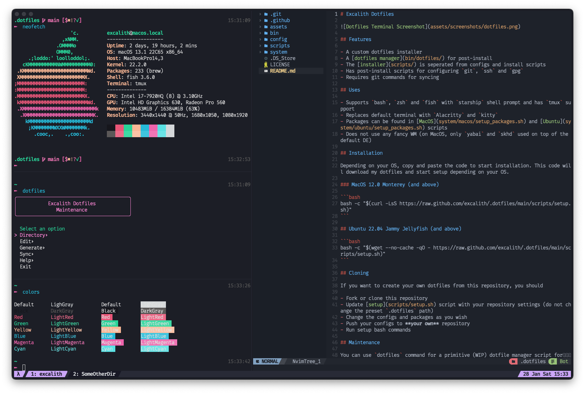

<p align="center">
	<h1 align="center">brahmatruti Dotfiles</h1>
</p>



## Features

- **Multi-OS Support**: Ubuntu, Windows, macOS, Arch Linux, Alpine Linux
- **Centralized Configuration**: All app configs in `config/` directory
- **Development Machine Detection**: Interactive setup for dev environments
- **Modern Package Managers**: Native to each OS (apt, winget, brew, pacman, apk)
- **VSCode Integration**: 50+ curated extensions with centralized settings
- **Infrastructure Tools**: Docker, Ansible, Terraform across all platforms
- **Shell Support**: Fish, Zsh, Bash, PowerShell with Starship prompt
- **NFS Support**: Network file system configuration (Linux)
- **Security Focused**: Package verification and minimal installations

## Architecture

- **[Configuration Hub](config/)**: Centralized application configurations
- **[OS-Specific Scripts](system/)**: Installation scripts per operating system
- **[Memory Bank](memory-bank.md)**: Comprehensive implementation guide
- **[VSCode Setup](config/vscode/)**: Editor configuration and extensions
- **[Documentation](system/*/README.md)**: Detailed guides per OS

## Installation

> [!CAUTION]
> If you have no idea what a dotfile is all about, please do not simply run these commands. They will override your configurations with my configurations and install bunch of packages.

Depending on your OS, copy and paste the code to start installation. This code will download my dotfiles and start setup depending on your OS.
connect email =133171373+Brahmatruti[domain]users.noreply.github.com 
### MacOS Monterey (and above)
<details>
 <summary>MacOS Monterey (and above)</summary>
<pre lang="bash">bash -c "$(curl -LsS https://raw.github.com/brahmatruti/.dotfiles/main/scripts/setup.sh)"</pre>
</details>


### Ubuntu 22.04 Jammy Jellyfish (and above)
<details>
 <summary>Download and Setup</summary>
<pre lang="bash">bash -c "$(wget --no-cache -qO - https://raw.github.com/brahmatruti/.dotfiles/main/scripts/setup.sh)"</pre>
</details>


### Arch Linux
<details>
 <summary>Download and Setup</summary>
<pre lang="bash">bash -c "$(wget --no-cache -qO - https://raw.github.com/brahmatruti/.dotfiles/main/scripts/setup.sh)"</pre>
</details>

### Lite Version

This is a minimal installation for Termux app on Android.

```bash
bash -c "$(curl -LsS https://raw.github.com/brahmatruti/.dotfiles/main/system/lite/install.sh)"
```

### Windows (10 and above)

#### Windows

Allow remote scripts to run

```ps
Set-ExecutionPolicy Bypass -Scope Process; Set-ExecutionPolicy -Scope CurrentUser -ExecutionPolicy RemoteSigned -Force
```

Download the dotfiles and start setup

```ps
Invoke-Expression (Invoke-WebRequest -Uri 'https://raw.githubusercontent.com/brahmatruti/.dotfiles/main/scripts/setup.ps1').Content
```

Reset Execution Policy (Optional)

```ps
Set-ExecutionPolicy -Scope Process -ExecutionPolicy Restricted
```

#### WSL Ubuntu

To install packages for WSL Ubuntu, run the following command on WSL terminal.

```bash
bash -c "$(wget --no-cache -qO - https://raw.github.com/brahmatruti/.dotfiles/main/scripts/setup.sh)"
```

## Supported Operating Systems

### 🐧 Ubuntu 22.04+
- **Package Managers**: APT, Snap, Flatpak
- **Features**: NFS support, Gnome integration, PPAs
- **Documentation**: [Ubuntu Guide](system/ubuntu/README.md)
- **Development Tools**: Docker, Ansible, Terraform, Python, Java, Node.js

### 🪟 Windows 10/11
- **Package Managers**: WinGet, Chocolatey
- **Features**: WSL support, PowerShell, Registry configuration
- **Documentation**: [Windows Guide](system/windows/README.md)
- **Development Tools**: Docker Desktop, Azure CLI, AWS CLI, Python, Node.js

### 🍎 macOS Monterey+
- **Package Managers**: Homebrew, Mac App Store
- **Features**: Launch agents, security considerations
- **Documentation**: [macOS Guide](system/macos/README.md)
- **Development Tools**: Docker, Ansible, Terraform, Python, Java, Node.js

### 🏹 Arch Linux
- **Package Managers**: Pacman, AUR (yay)
- **Features**: Rolling release, minimal base
- **Documentation**: [Arch Guide](system/arch/README.md)
- **Development Tools**: Docker, Ansible, Terraform, Python, Java, Node.js

### 🏔️ Alpine Linux
- **Package Managers**: APK
- **Features**: Lightweight, security-focused
- **Documentation**: [Alpine Guide](system/alpine/README.md)
- **Development Tools**: Docker, Ansible, Terraform, Python, Java, Node.js

## Development Machine Setup

During installation, you'll be prompted to configure your machine as a development environment. This includes:

- **Languages**: Python, JavaScript, Java, C/C++, PHP
- **Infrastructure**: Docker, Ansible, Terraform
- **Cloud Tools**: Azure CLI, AWS CLI
- **Version Control**: Git, Git LFS
- **Editors**: VSCode with 50+ extensions

## Configuration Management

### Centralized Configuration
All application configurations are stored in the `config/` directory:
- **[VSCode](config/vscode/)**: Editor settings and extensions
- **[Shell](config/fish/)**: Fish shell configuration
- **[Git](config/git/)**: Git settings and aliases
- **[Other Apps](config/)**: Additional application configs

### VSCode Integration
- **50+ Extensions**: Curated development tools
- **Centralized Settings**: Universal configuration across OS
- **Auto-Installation**: Extensions installed automatically
- **Theme**: Material Design with custom terminal colors

## Documentation

- **[Memory Bank](memory-bank.md)**: Comprehensive implementation guide
- **[OS-Specific Guides](system/*/README.md)**: Detailed setup instructions
- **[VSCode Guide](config/vscode/README.md)**: Editor configuration
- **[Architecture](memory-bank.md#architecture-principles)**: System design principles

## Post-Installation

Optionally, if you want to set upstream with this repository, you can run the following command.

```bash
# Initialize git repository
git init

# Add this repository as remote
git remote add origin git@github.com:brahmatruti/.dotfiles.git

# Fetch the main branch
git fetch origin main

# Reset the dotfiles folder and replace with main branch
git reset --hard origin/main
```

## Using Dotfiles

After installing the dotfiles, you can pretty much start using these configurations right away.

- All changes to configuration files will be recognized by git as modified within dotfiles folder except for the config files created with `.local` suffix.
- You can use `dotfiles` command for dotfile manager script for running maintenance commands.

## Making Your Own Dotfiles

If you want to create your own dotfiles based on my configuration, you should

1. Fork or download this repository
2. Update [setup](scripts/setup.sh) script with your repository settings (do not change the preset `.dotfiles` path)
3. Change the configurations and packages as you wish
4. Push your changes to **your own** repository
5. Run setup bash commands

## Credits

This dotfiles repository is a heavily ~~knocked-off~~ inspired version of beautiful [Cătălin’s dotfiles](https://github.com/alrra/dotfiles). You should probably check it out!

I have modified this dotfiles with my own taste of config files and added a bunch of helpers and utilities to install packages, extensions etc. from different sources that I trust. I tried to seperate installation system and OS-spesific configurations as much as I can, so it would be easier to implement new OS setups which I might do later.

## License

The code is available under the [MIT license](LICENSE).
